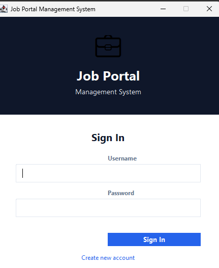
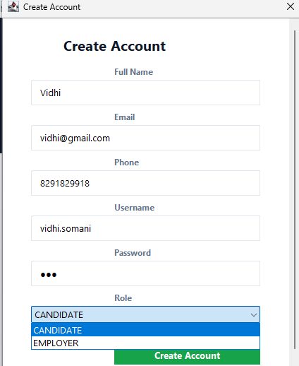
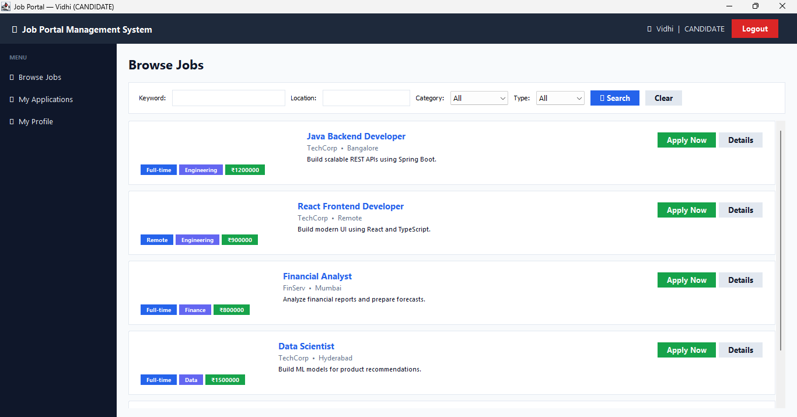
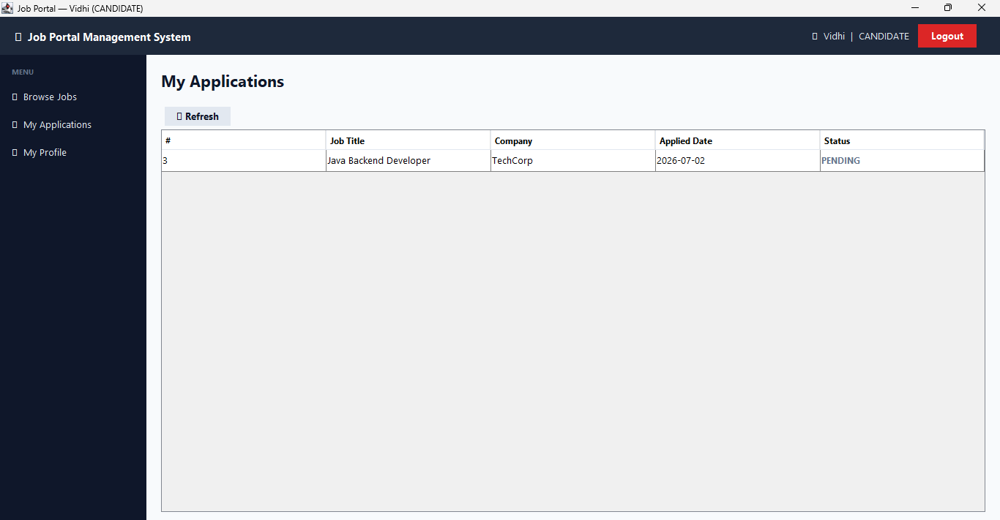
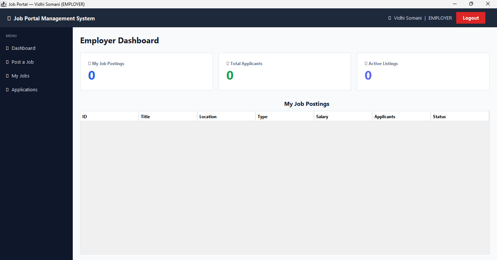
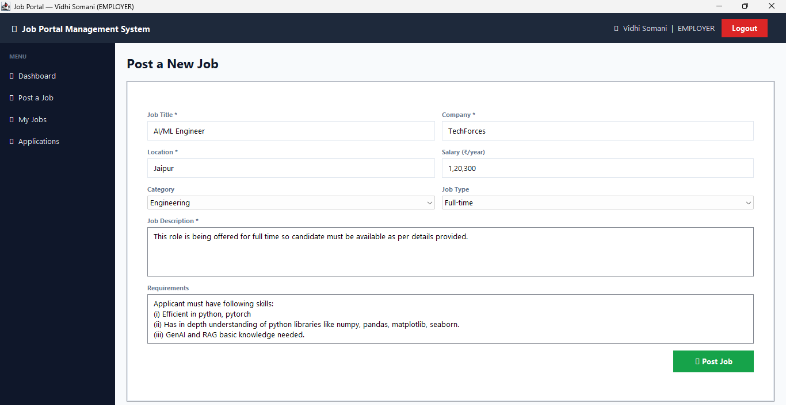
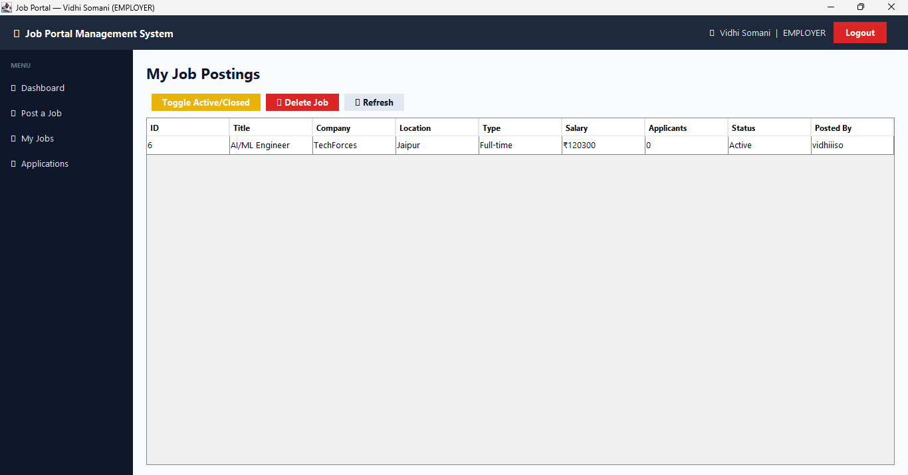
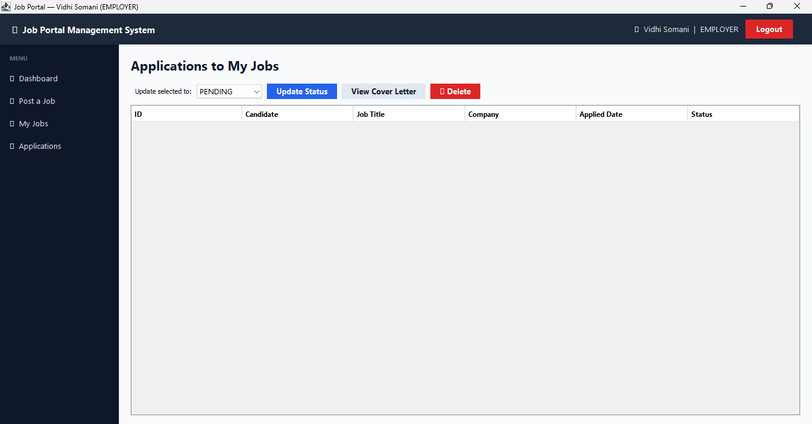

# Job Portal Management System


A desktop-based **Job Portal Management System** built using **Java** and **Swing** that simulates the recruitment workflow between **Employers** and **Candidates**.

The application provides dedicated role-based interfaces where employers can create and manage job postings, while candidates can browse available opportunities, submit applications, and track their application status through an intuitive graphical user interface.

This project demonstrates Java programming, Object-Oriented Programming (OOP), GUI development using Swing, and modular software design.

---

## Features

### Employer Module

- Employer Registration & Login
- Employer Dashboard
- Post New Job Listings
- View Job Postings
- View Applications
- Update Application Status
- Delete Job Postings

### Candidate Module

- Candidate Registration & Login
- Browse Available Jobs
- Search Job Opportunities
- View Job Details
- Apply for Jobs
- Track Application Status

### User Interface

- Modern Java Swing GUI
- Separate Dashboards for Employers and Candidates
- Role-Based Navigation
- Clean and User-Friendly Interface
- Modular Project Structure

---

# Tech Stack

| Technology | Purpose |
|------------|----------|
| Java | Core Programming Language |
| Java Swing | Graphical User Interface |
| Object-Oriented Programming (OOP) | Application Design |
| Java Collections Framework | Data Management |
| Modular Architecture | Code Organization |

---

# Project Structure

```text
Job-Portal/
│
├── bin/
├── screenshots/
├── src/
│   ├── main/
│   ├── dao/
│   ├── model/
│   ├── ui/
│   └── util/
│
├── README.md
└── run.bat
```

### Package Description

| Package | Description |
|----------|-------------|
| `main` | Application Entry Point |
| `dao` | Data Access Components |
| `model` | Domain Models |
| `ui` | Graphical User Interface |
| `util` | Helper & Utility Classes |

---

# Application Workflow

## Employer Workflow

```text
Create Account
      │
      ▼
Login
      │
      ▼
Employer Dashboard
      │
      ├────────► Post New Job
      │
      ├────────► View Job Postings
      │
      └────────► Review Applications
```

---

## Candidate Workflow

```text
Create Account
      │
      ▼
Login
      │
      ▼
Browse Available Jobs
      │
      ▼
Apply for Jobs
      │
      ▼
Track Applications
```

---

# Screenshots

## Login Screen



---

## Create Account



---

## Browse Jobs (Candidate)



---

## Applications (Candidate)



---

## Employer Dashboard



---

## Post Job (Employer)



---

## Job Postings (Employer)



---

## View Applications (Employer)



---

# Learning Outcomes

This project helped strengthen my understanding of:

- Object-Oriented Programming (OOP)
- Java Swing Application Development
- Event-Driven Programming
- GUI Design Principles
- Modular Software Architecture
- Java Collections Framework
- Role-Based Application Design
- Desktop Application Development

---

# Future Improvements

Some planned enhancements include:

- Persistent Database Integration (MySQL / SQLite)
- Secure Password Encryption
- Resume Upload Feature
- Email Notifications
- Admin Dashboard
- Advanced Job Search Filters
- Company Profiles
- Interview Scheduling
- Analytics Dashboard

---

# Getting Started

## Clone the Repository

```bash
git clone https://github.com/vidhi-somani/Job-Portal.git
```

## Navigate to the Project

```bash
cd Job-Portal
```
## Prerequisites

- Java JDK 17 or later
- IntelliJ IDEA / Eclipse / VS Code

## Run the Application

1. Clone this repository.
2. Open the project in your preferred Java IDE.
3. Navigate to the `src` folder.
4. Run `Main.java`.

Alternatively, execute:

```bash
run.bat
```

on Windows.

# Contributing

Contributions, suggestions, and feature requests are welcome.

If you'd like to improve this project, feel free to fork the repository and submit a pull request.

---

# Author

**Vidhi Somani**

GitHub: https://github.com/vidhi-somani

---

## ⭐ Support

If you found this project helpful or interesting, consider giving it a **Star ⭐** on GitHub.
